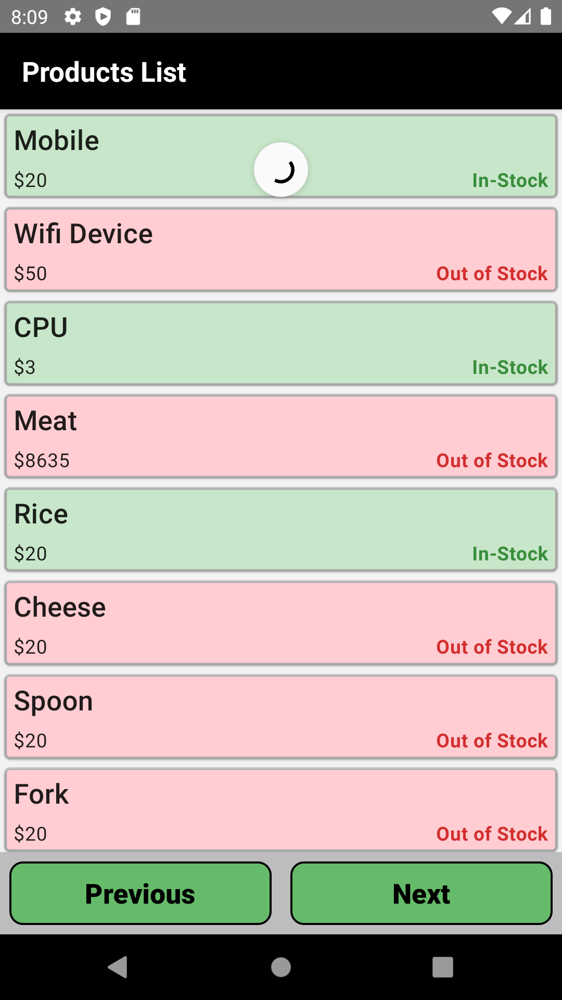
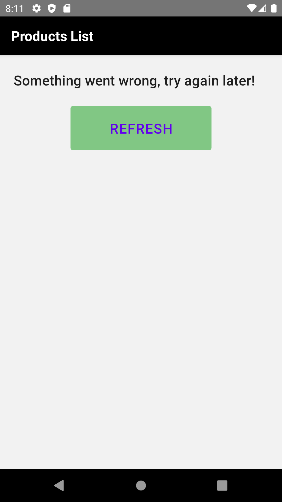
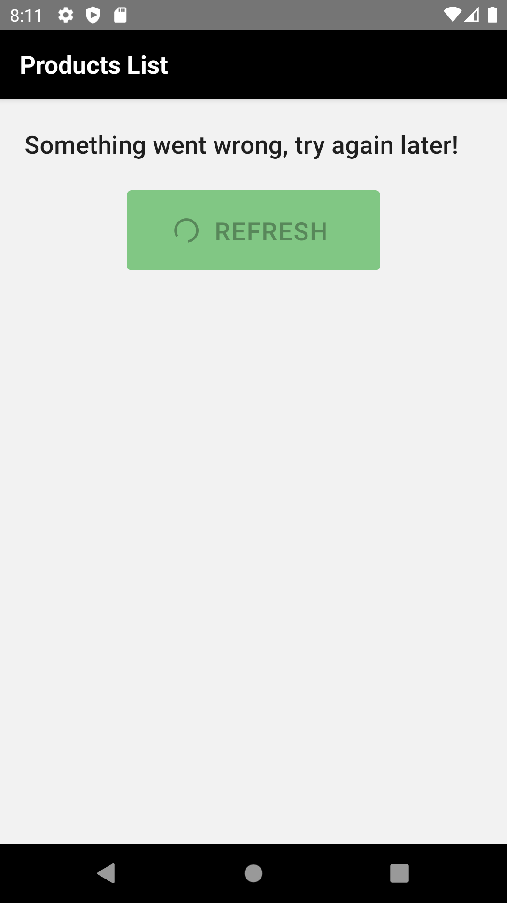

# Cantiin-React-Native
Creating an android application for cantiin


**Watch video on Youtube: https://www.youtube.com/watch?v=4nlIVCSuJrw**


# A) How to run:
## A-1) Preparing react native:

In the CLI, run this code:

```bash
export NODE_OPTIONS=--openssl-legacy-provider
npm start
```

## A-2) Running the application:


Open **another** commandline interface window, and run this command:

```bash
npx react-native run-android
```


**OR** go the android studio, and run the application on the emulator.

## A-3) Debugging:

Run the application with React-Native Debugger.  
To control the application in the emulator, **`ctrl + m`**


# B) How it works:

1. It communicates with a RESTful API at https://www.cantiin.com/api/products/, and it paginates through the list of products.





2. If something went wrong while sending the request (For example: No internet connection), It will show a messgae, and you can always refresh the page






