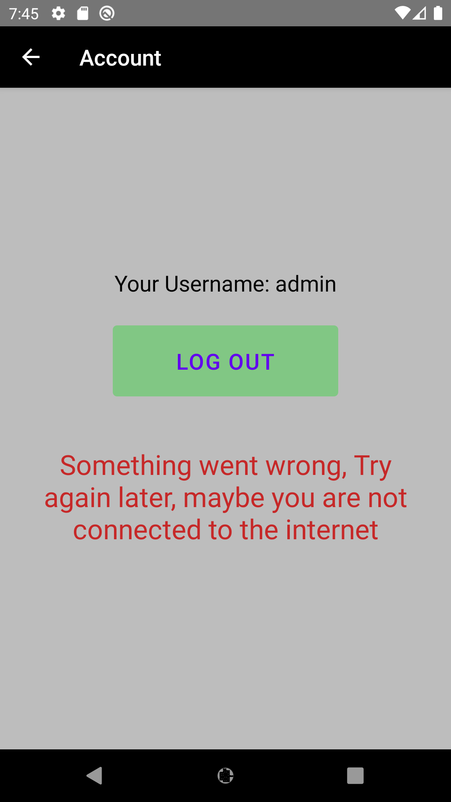

# Cantiin-React-Native

**Watch video on Youtube: https://www.youtube.com/watch?v=16v0MCEKS-c**


Creating an android application for cantiin


# A) Used Technologies:

1. React
2. React native
3. React Native Paper
4. Async Storage
5. React Navigation


# B) How to run:
## B-1) Preparing react native:


In the CLI, run this code:

```bash
git clone https://github.com/OmarThinks/Cantiin-React-Native
cd Cantiin-React-Native
npm install
npm start
```

## B-2) Running the application:


Open **another** commandline interface window, and run this command:

```bash
npx react-native run-android
```


**OR** go the android studio, and run the application on the emulator.

## B-3) Debugging:

Run the application with React-Native Debugger.  
To control the application in the emulator, **`ctrl + m`**


# C) How it works:


- **It communicates with a RESTful API at https://www.cantiin.com/api/products/, and it paginates through the list of products.**


- You can Log in

<br>


- If you logged in, you will see your username in the account intent, and the ability to log out.


- Now that you are logged in, the Products list will hav the option to add a new product, 
from FAB (Floating Action Button) on the bottom right of the page.


- Logged in ore now, you acn paginate through the products pages


- This is how you can create a new product


- There is validation in the restful API


# D) No Internet Connection:

- If something went wrong while sending the request (For example: No internet connection), It will show a messgae, and you can always refresh the page or resend the request.


## No Internet: Products List:


## No Internet: Log In:


## No Internet: Log Out:




## No Internet: Craete Product:


